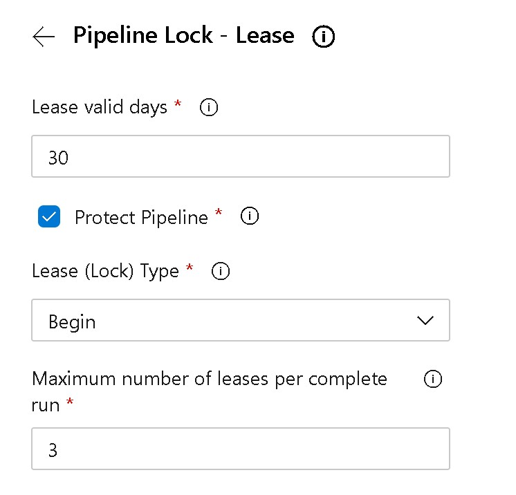
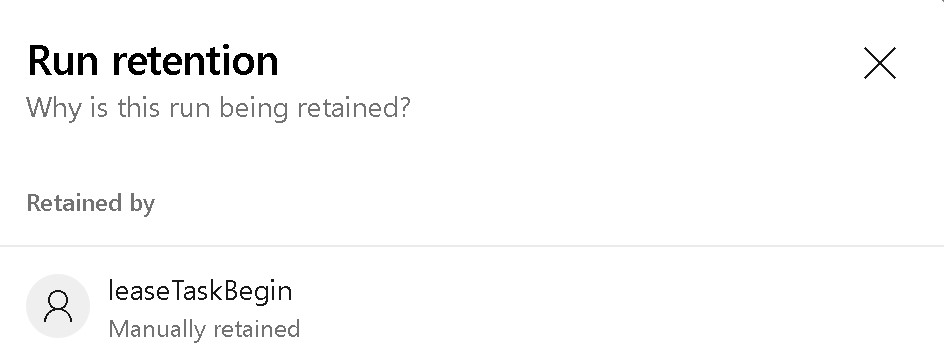
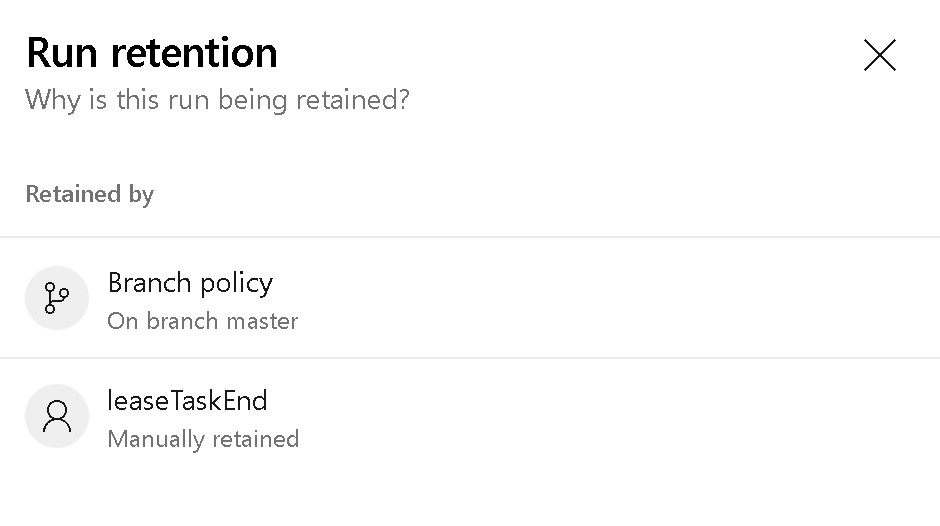

This extension is intended to improve Azure Devops Retention policies with multi-stage yaml pipelines. Currently you can delete pipeline runs in the middle of the process and retetion will only apply to the latests runs and not mantained per environment, this extension will help to create temporary leases to avoid unintentional deletion of running pipelines and run complete leases to maintain a customizable number of completed runs, even outside the retention default behavior.

## How to use

After installed you can add this task at the begining of your multi-stage yaml pipeline and again at the end of it.

The begin mode will create a temporary lease valid up to your configured value in days (Lease valid days), so if you have a manual step on your pipeline it will avoid deletions.

The end mode will delete the temporary lease and create a new one, it will keep up to your configured value of completed runs (Maximum number of leases per complete run). It will clean-up active older leases outside your configured range automatically as well.

## Available tasks

Azure DevOps

- **Pipeline Lock - Lease**: Improve retation policies on multi-stage yaml pipelines.
